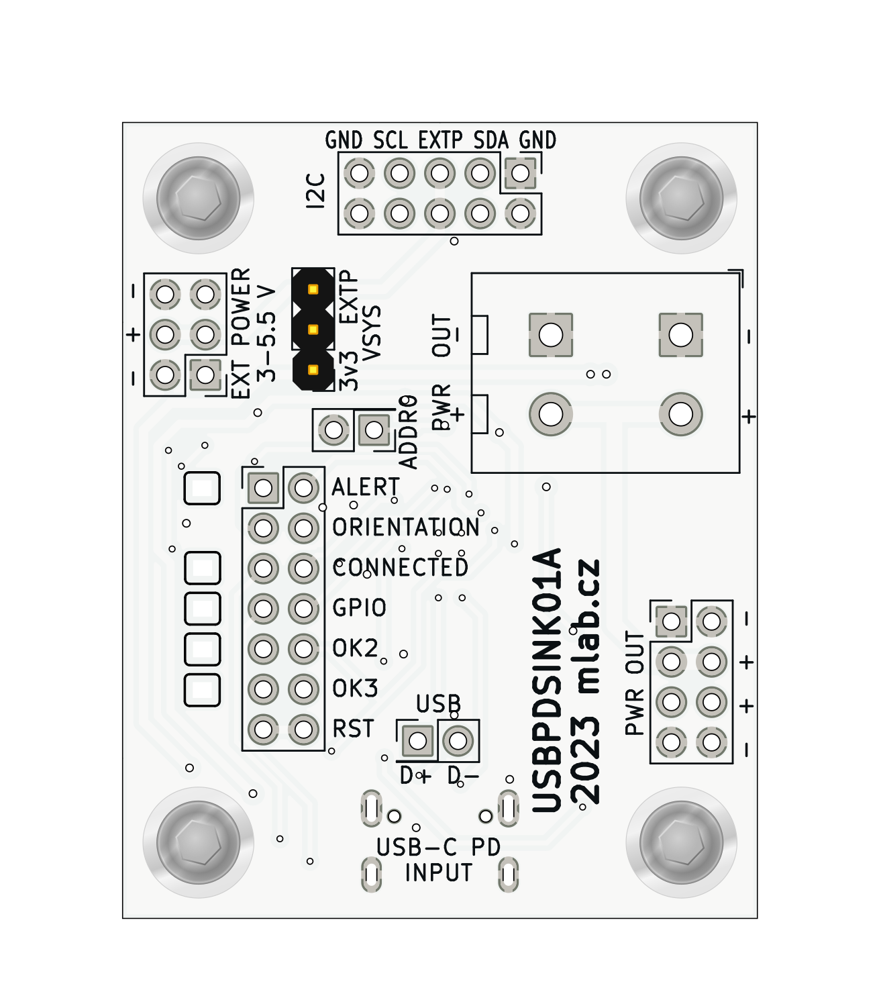
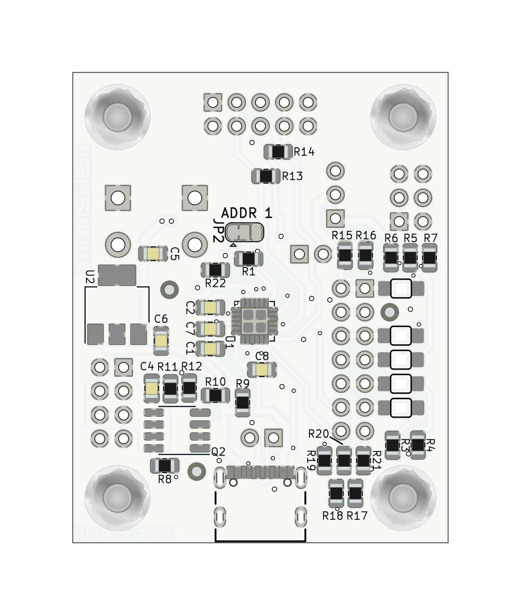

# USBPDSINK01

The [MLAB](https://www.mlab.cz) module [USBPDSINK01](https://www.mlab.cz/module/USBPDSINK01) is a powerful module containing the [TI STUSB4500 power-delivery sink controller](https://www.st.com/en/interfaces-and-transceivers/stusb4500.html). This module is designed to provide a flexible and reliable solution for various applications requiring USB power delivery.

  

## Specifications
### [STUSB4500](https://www.st.com/en/interfaces-and-transceivers/stusb4500.html)

STUSB4500 is an autonomous USB-C PD controller for Power Sinks / UFP (on the device side). It's a simple solution to replace a standard connector, instead using a universal USB connector. It is certified by the USB-IF consortium for [USB Type-C](https://www.usb.org/usb-type-c) and [USB Power Delivery](https://www.usb.org/usb-charger-pd) applications (USB-C & USB PD).

### Module Features

- **USB-C Input:** The module accepts power through the USB-C connector.
- **Power Output:** The output is led to a pin header and also to a WAGO terminal block with tool-free connecting.
- **Indicator Pins with LED:** Some status pins contain LEDs, and these signals are connected to the pin header.
- **Pull-up Resistors:** The module has pull-up resistors on the output signals for fast implementation into your system. PullUp voltage can be attached to header pins or can be used internal 3v3.
- **Integrated LDO:** The module is equipped with an integrated LDO for powering pullups and LED (no output).
- **External Power Supply:** The VSYS power can also be attached externally.
- **Communication via I2C:** The module communicates via I2C bus.
- **Key Features of [STUSB4500](https://www.st.com/en/interfaces-and-transceivers/stusb4500.html):**
  - Auto-run USB Type-C™ and USB PD sink controller
  - Dead battery mode support
  - Up to 3 configurable sink PDO profiles (with permanent memory)
  - Integrated VBUS switching gates (PMOS transistor)
  - Integrated VBUS voltage monitoring
  - Internal and/or external VBUS discharge paths (for high cappacitance networks)
  - Short-circuit protection on VBUS pins (22 V)
  - High-voltage capability on VBUS pins (28 V)
  - Dual power supply (VSYS and/or VDD): VDD = [4.1 V; 22 V] or VSYS = [3.0 V; 5.5 V]
  - Accessory mode support
  - Temperature range: -40 °C to 105 °C
  - ESD: 3 kV HBM - 1.5 kV CDM
  - Certified: USB Type-C™ rev 1.2, USB PD rev 2.0 (Official Test ID: TID #1000133)
  - Interoperable with USB PD rev 3.0

### Pinout and Their Meaning

- **ALERT:** Notification of various states and events.
- **USB-C orientation:** Indication of the connected side of the USB-C cable.
- **CONNECTED:** Cable connection indication.
- **GPIO:** General input/output pin, configurable for various purposes.
- **OK2 & OK3:** Pins that are active when the corresponding PDO is selected. Can indicate the selected voltage.
- **RESET:** Pin for resetting the USB-PD controller.

## Possible Applications
The MLAB module USBPDSINK01 is ideal for a wide range of applications, including:

- **Device Charging:** Fast and efficient charging of devices with high battery capacity. The module allows automatic negotiation of higher voltage from the source (>5V) up to 100W (20V@5A), ensuring the optimal charging profile for various types of batteries.

- **Scientific and Industrial Applications:** Flexible power and control for various scientific and industrial applications. With the ability to configure up to three sink PDO profiles, the module can be tailored to specific research or manufacturing needs.

- **Development and Testing:** The module can be used as part of development and testing stations for various products. With integrated VBUS switching gates and short-circuit protection up to 22 V, the module offers a robust and safe solution for testing and tuning.

- **Universal Power Source:** The module can serve as a universal power source for various devices, including charges, speakers, machines, or other electronic devices that require high-wattage power source.

 

## Schematics

## Documentation
- [STUSB4500 Datasheet](https://www.st.com/resource/en/datasheet/stusb4500.pdf)

## Conclusion

The MLAB module USBPDSINK01 represents a robust and flexible solution for various applications requiring USB power delivery. With the integrated STUSB4500 controller, advanced features, and a wide range of possible applications, this module is the ideal choice for developers and engineers looking for a reliable and powerful solution.
